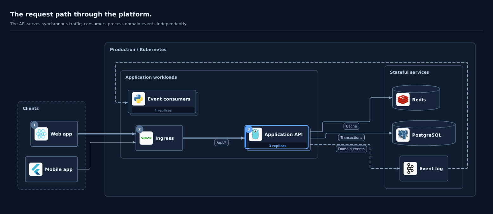
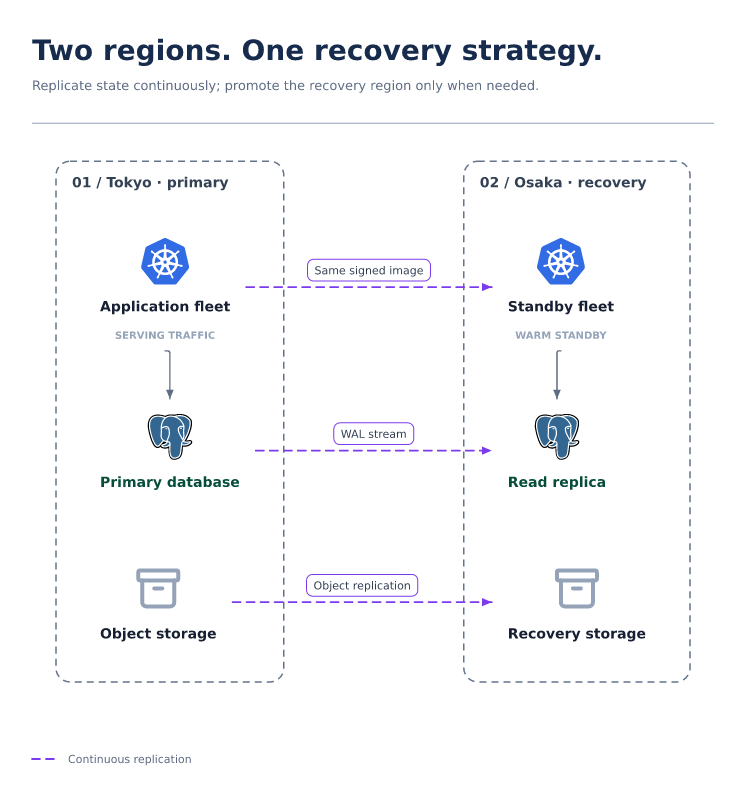

# TopoIR

**Agent-native visual compiler for system topology.**

TopoIR turns a compact semantic architecture model into deterministic SVG and PNG diagrams, with presentation-grade quality as its primary product goal. The author—usually an AI coding agent—describes systems, boundaries, relationships, protocols, and views. TopoIR owns measurement, layout, ports, orthogonal routing, labels, themes, icons, validation, and rendering.

> Agents understand architecture. TopoIR understands diagrams.



TopoIR is an early alpha. Its document version is deliberately `v1alpha1`; use it now for evaluation and contribution, but expect schema migrations before 1.0.

The six supplied reference screenshots are the [visual acceptance benchmark](docs/visual-benchmark.md). Current outputs demonstrate compiler capability and visual variety; they have **not yet achieved the full reference quality/complexity gate**. Run `pnpm benchmark:references` after building to generate a paired review report with honest per-case gaps.

## Why TopoIR

Text-to-diagram tools often make the model author encode presentation tricks, while canvas editors make automation manipulate coordinates. TopoIR is a compiler between those extremes:

```text
YAML / JSON semantics
  → source-aware validation
  → normalized system model
  → view projection
  → theme, icon, and text measurement
  → compound architecture layout
  → port assignment and orthogonal routing
  → geometry quality gates
  → scene graph
  → canonical SVG / PNG
```

The public document contains no required `x`, `y`, width, control point, or layout-engine option. The same system model can generate focused context, deployment, data-flow, or security views.

## Try it from this repository

Requirements: Node.js 22 or 24 and pnpm 11.

```bash
corepack enable
pnpm install
pnpm build
pnpm topoir validate examples/checkout-platform.topoir.yaml
pnpm topoir render examples/checkout-platform.topoir.yaml \
  --view overview \
  --format both \
  --output .tmp/render \
  --manifest
```

The published-package commands will be:

```bash
pnpm add --global @topoir/cli
topoir doctor
```

## Minimal semantic document

```yaml
apiVersion: topoir.dev/v1alpha1
kind: Architecture
metadata:
  name: payments
  title: Payments Platform
model:
  groups:
    - id: production
      kind: kubernetes-cluster
      label: Production
  nodes:
    - id: api
      kind: api
      label: Payments API
      group: production
    - id: postgres
      kind: database
      technology: postgresql
      group: production
  edges:
    - id: api-to-postgres
      from: api
      to: postgres
      label: SQL
      protocol: PostgreSQL
      kind: write
views:
  - id: overview
    layout:
      direction: right
```

```bash
topoir validate payments.topoir.yaml
topoir render payments.topoir.yaml --output payments.svg
```

## Agent-focused interfaces

The CLI is non-interactive, reads `-` from stdin, keeps logs on stderr, supports JSON diagnostics, and uses stable exit codes.

| Command | Purpose |
|---|---|
| `topoir validate <file\|->` | Parse, structurally validate, and check semantic references |
| `topoir render <file\|->` | Compile one or all views to SVG, PNG, or both |
| `topoir inspect <file\|->` | Print normalized model, view, geometry, metrics, or manifest JSON |
| `topoir schema` | Print the canonical JSON Schema |
| `topoir assets search <query> --assets <directory>` | Search offline built-in/custom assets with provenance |
| `topoir styles` | Discover visual-language metadata |
| `topoir doctor` | Verify schema, layout, SVG, and native PNG support |

The MCP server exposes four task-level tools—`validate_document`, `render_document`, `inspect_document`, and `search_icons`—plus schema, quickstart, diagnostics and design resources. It does not expose dozens of graph mutation calls; agents edit one semantic document and compile it.

```json
{
  "mcpServers": {
    "topoir": {
      "command": "node",
      "args": ["/absolute/path/to/topoir/packages/mcp/dist/bin.js"]
    }
  }
}
```

The reusable agent instructions live at [`skills/topoir/SKILL.md`](skills/topoir/SKILL.md).

## Visual capability

TopoIR supports nested groups, compound cross-boundary edges, semantic ports in topology layouts, labeled/colored flows, annotations, legends and multiple views. View design adds a takeaway, focus and story; seven visual languages offer heterogeneous shapes, icon-led components, status and replica summaries. The offline inventory contains 3,021 SVG assets with provenance; custom SVG/PNG/JPEG/WebP inputs are measured and safely embedded. Topology candidate evaluation, layered layouts, experimental sequence lifelines and structured comparison/domain panels provide different compositions.



The [showcases](examples/showcase) include incident, sequence, Kubernetes, pipeline, conceptual, executive and before/after views. [Custom assets](examples/custom-assets) have a runnable local example. The regression matrix separately targets deep nesting, parallel edges, cross-boundary fan-out, cycles, disconnected grids, and long pipelines.

## Packages

| Package | Responsibility |
|---|---|
| `@topoir/schema` | Versioned JSON Schema, TypeScript authoring types, YAML parser, source map, TOP1xx diagnostics |
| `@topoir/core` | Semantic analysis, normalized/view/measured/geometry IRs, themes, measurement, quality gates |
| `@topoir/assets` | Offline icon registry, aliases, provenance and safe local image inventory |
| `@topoir/layout-elk` | ELK adapter, bounded composition selection and local routing/label refinement |
| `@topoir/renderer-svg` | Scene graph, canonical SVG, bundled fonts/icons, resvg PNG export |
| `@topoir/sdk` | End-to-end compiler API, artifacts, stable hashes, manifests |
| `@topoir/cli` | Agent-friendly `topoir` executable |
| `@topoir/mcp` | MCP 2026-07 stdio server |

Raw ELK configuration is intentionally not part of the public TopoIR schema. Other layout adapters can implement the core `LayoutEngine` contract without changing semantic documents.

## Determinism

For the same document, view, TopoIR version, dependency lock, and platform target, the compiler uses stable ordering, a fixed layout seed, fixed coordinate precision, explicit assets, no timestamps, canonical SVG attribute ordering, and manifests with input/output SHA-256 hashes. System fonts and network assets are disabled. The test suite asserts byte-identical repeated SVG output and a golden quickstart hash.

## Documentation

- [Architecture and compiler stages](docs/architecture.md)
- [Research, design decisions and implementation plan](docs/visual-quality-plan.md)
- [Reference screenshot acceptance benchmark](docs/visual-benchmark.md)
- [Schema and authoring model](docs/schema.md)
- [CLI reference](docs/cli.md)
- [MCP server](docs/mcp.md)
- [Diagnostics](docs/diagnostics.md)
- [Icons, fonts, and licensing](docs/assets.md)
- [Roadmap](ROADMAP.md)
- [Contributing](CONTRIBUTING.md)
- [Security policy](SECURITY.md)

## Current boundaries

v0.1 focuses on the compiler and a small set of strong architecture patterns. It is not a whiteboard, generic diagram editor, Mermaid wrapper, embedded-LLM product, or manual pixel-authoring tool. Composite gateway compartments, general repeated-region constraints, boundary portals, prior-layout stability, insets, true illustrated sketch/isometric grammars and full reference-equivalent fixtures remain roadmap work. Provider-native service catalogs require separate licensing review. A before/after composition is not yet automatic architecture diffing.

## License

TopoIR code is available under the [MIT License](LICENSE). Dependency-provided fonts and artwork retain their own licenses and trademark terms; see [asset licensing](docs/assets.md).
