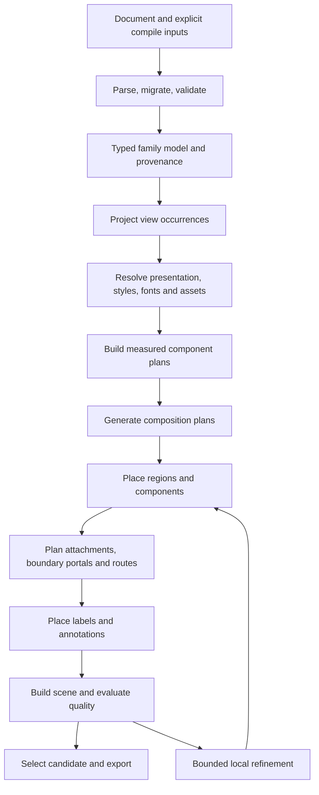

# System architecture

## Target pipeline



The outer agent chooses facts, families and presentation plans. It receives capability metadata, previews, candidate explanations and repair diagnostics. No stage of the deterministic compiler calls an LLM, fetches network assets, or reads hidden layout history.

## Stage contracts

| Stage | Output | Invariant |
| --- | --- | --- |
| Load | `LoadedWorkspace` | Version known; unknown fields rejected; raw source pointers retained |
| Normalize | `NormalizedWorkspace` | Defaults explicit; family payload typed; IDs/references resolved; provenance retained |
| Project | `ProjectedView` | Every occurrence maps to a model element; omissions and aggregation are explicit |
| Resolve | `ResolvedPresentation` | Every style/font/asset/strategy ID is versioned and supported |
| Measure | `MeasuredDiagram` | All content blocks, ink bounds, silhouettes and attachments measured together |
| Compose | `CompositionPlan[]` | Candidate structure preserves required meaning and constraint identities |
| Layout | `PlacedDiagram` | Positions refer to measured plans, not renderer-created dimensions |
| Route | `RoutedDiagram` | Endpoints, intentional junctions and boundary crossings have owners |
| Scene | `SceneDocument` | Final text, marks, header, legend and overlays have source/semantic ownership |
| Evaluate | `QualityReport` | Constraint status and visible-content accounting are complete |
| Select/export | `CompileResultV2` | Acceptance is distinct from artifact existence; manifest records complete output-affecting inputs |

Every stage returns typed diagnostics and timing/counter telemetry through a separate observation channel. Operational timing is excluded from canonical artifact/manifests. Stages may return inspectable partial data on failure, but it is labeled partial and cannot be promoted to an accepted artifact.

## Ownership and package evolution

| Area | Initial home | Target responsibility |
| --- | --- | --- |
| Public schema, migrations, codes | `packages/schema` | Canonical wire contract and generated authoring types |
| Family, component, presentation and quality interfaces | `packages/core` | Pure shared contracts and deterministic logic |
| Assets and fonts | Existing assets/core modules first | Versioned inventory, resolved data, metrics and hashes |
| Composition/routing orchestration | `packages/layout-elk/src` submodules first | Separate compiler-owned planning from backend translation |
| ELK adapter | `packages/layout-elk` | Only translate compatible layout requests/results |
| Generic composition implementation | New `packages/layout` at T15 | Backend-neutral orchestration; depends on core and adapters |
| Family implementations | `packages/core/src/families` initially | Typed lowering, notation, validation, strategy declarations |
| SVG/PNG renderer | `packages/renderer-svg` | Render measured scene without semantic/layout decisions |
| Pipeline, cache and result API | `packages/sdk` | Orchestration and explicit host capabilities |
| CLI/MCP | Existing packages | Thin adapters to one shared application API |
| Workbench | `apps/workbench` at its milestone | Local review UI consuming SDK/scene contracts |

Dependency rule: schema → core contracts; assets and adapters depend only on lower layers; renderer consumes core scene contracts and resolved assets; SDK composes implementations; CLI/MCP/UI consume SDK. Core must never import the SDK, renderer or ELK. Public dependency cycles fail the build.

Move scene interfaces into core during the component/scene milestone; retain renderer re-exports for compatibility. Introduce `packages/layout` only once its interface exists, not as a prerequisite to early fixes. Defer independently published family/style packages until internal compatibility has stabilized.

## Family and strategy interfaces

The following is normative interface intent; generated runtime schemas remain the wire authority.

```ts
interface DiagramFamily<Model, Projection> {
  id: string;
  version: string;
  status: "experimental" | "supported";
  schemaId: string;
  capabilities: FamilyCapabilities;
  validate(model: Model, context: SemanticContext): Diagnostic[];
  project(model: Model, view: ViewDefinition): ProjectionResult<Projection>;
  lower(view: Projection, context: ResolveContext): DiagramIntent;
  validateMeaning(input: Projection, output: SceneDocument): Diagnostic[];
}

interface CompositionStrategy {
  id: string;
  version: string;
  supports(intent: DiagramIntent): CapabilityMatch;
  plan(input: MeasuredDiagram, context: PlanningContext): CompositionPlan[];
}

interface LayoutAdapter {
  id: string;
  version: string;
  capabilities: LayoutCapabilities;
  place(request: LayoutRequest, control: ExecutionControl): Promise<PlacementResult>;
}
```

`supports` returns supported features and explicit unmet requirements; it does not silently drop constraints. Strategies can share placement primitives without lowering all families to the same generic graph. Time axes and interaction event trees remain typed until their coordinates are fixed.

One capability registry is the source for discovery, schema discriminators, documented maturity, applicable examples and strategy compatibility. A requested unsupported family or required feature fails before layout. Unknown `x-*` metadata remains inert, never an undocumented execution hook.

## Reproducibility and stability

Separate raw input hash, canonical document hash, and compilation fingerprint. The fingerprint includes compiler/contract versions, target platform, normalized view and presentation, deterministic work budget, strategy versions/seeds, resolved font and asset hashes, exporter options, and explicit prior-layout hash. A cache hit must be output-neutral.

No timestamps, absolute host paths, elapsed timings, local object handles, or random IDs enter canonical output. Host/source locations can live in a noncanonical envelope; artifact attribution uses portable identifiers. Sort unordered collections by stable ID; preserve semantically ordered arrays such as events, asset roles and process branches. Round final coordinates to fixed precision after computation; do not repeatedly round during solving.

Repeatability is guaranteed only within the declared compiler/dependency/platform target until cross-platform fixtures prove more. Prior geometry is explicit versioned input, with occurrence IDs and compatibility metadata. On incompatibility, warn and continue without that prior rather than reusing stale coordinates silently.

## Budgets, cancellation and failure

Deterministic modes use a fixed candidate/refinement work budget. Initial modes: `fast` (one macro candidate, one refinement), `balanced` (up to three macro candidates, two refinements each), `thorough` (up to six macro candidates, four refinements each). Strategy expansion is bounded within that total; fixed ordering resolves ties.

Wall-clock deadlines and cancellation are host controls. A deadline may produce a partial preview, but cannot masquerade as the same canonical full-budget result. Partial results include `completion: partial`, completed work counters and the reason, and cannot satisfy presentation acceptance. Run noninterruptible layout/native raster work in terminable workers when host cancellation is required.

Initial default host limits: 2 MiB source, 2,000 drawable occurrences per view, 10,000 relationships/events, containment depth 32, 2,000 custom assets, 10 MiB per asset, and 32 million output raster pixels. These are starting protective limits, not supported visual-density promises. Validate limits before expensive phases; account for raster scale before allocation. SDK hosts may tighten or explicitly raise limits under documented resource envelopes.

User/document errors return typed results. Catch backend and raster failures at stage boundaries, retaining safe stage/entity context and a stable code. Unexpected exceptions produce `TOP900_INTERNAL_ERROR`; detailed stack traces remain in opt-in local diagnostic logs. A failed view does not discard successful sibling views, but the multi-view request is marked partial/failed.

## Caching and performance

Cache immutable parse/normalization results, asset resolution, font runs, component plans, projection and complete candidates separately using content hashes and a bounded LRU. Never cache mutable caller objects. `inspect` may stop at its requested stage; it must not render SVG just to return a view. Serialize SVG once for both SVG and PNG exports.

Instrument parsing, resolution, shaping, composition, placement, routing, quality and export separately. Build spatial indices before optimizing intersection hot loops. Consider alternative solvers, workers or WASM only after a bounded benchmark demonstrates improvement on the failing workload. A new adapter must pass the same semantic and visible-content gates.

## Migration approach

First fix existing defects under v1alpha1, preserving successful behavior where possible. Introduce V2 contracts internally behind adapters, then ship v1alpha2 as an explicit new document version. Maintain v1alpha1 loading and CLI/API compatibility through the first supported multi-family release. The legacy `LayoutEngine` remains accepted through a compatibility adapter; unsupported new requirements are reported rather than ignored.

Semantic migrations preserve IDs, facts and source provenance. Pixel output may improve after defect fixes; every changed golden requires a visual explanation and explicit baseline evidence. A new version does not justify re-baselining away missing content.
