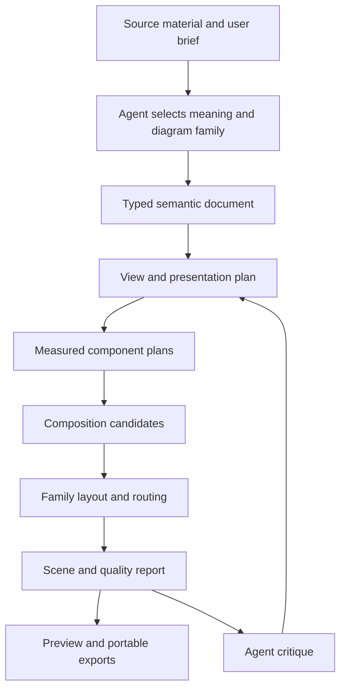

# TopoIR: product, architecture, and visual-quality review

Review date: 2026-09-19. Baseline commit: `bc64cf2`. This is a proposal, not an implementation commitment or a declaration of reference parity.

**Recommendation: preserve the deterministic compiler foundation, and evolve TopoIR into a family-based diagram design system for agents.** The largest opportunity is to improve what an agent can express, how the compiler turns that intent into a composition, and how both judge the resulting explanation. More icons, palettes, and graph-layout seeds will not by themselves deliver the requested breadth or quality.

The current product is a capable architecture-diagram compiler in alpha. It is not yet a general diagram platform, and its strongest quality guarantees concern geometric legality rather than communication quality. These are tractable limitations, but addressing them requires contracts and product decisions as well as rendering improvements.

## Evidence and scope

I inspected the eight packages, public schema, compiler stages, layout and routing implementation, renderer, agent skill, CLI/MCP interfaces, tests, benchmarks, CI, roadmap, and prior design plan. I ran the full build/typecheck/test pipeline, regenerated the six reference candidates twice through the existing benchmark, inspected all six supplied references and their corresponding candidate designs, and reviewed the sequence and comparison examples. I also created focused runtime probes for content preservation, theme inheritance, font resolution, agent intent, and output metadata.

- `pnpm check`: all builds and typechecks passed; **91 tests in 15 files passed**, with Vitest reporting 36.37 seconds on this machine.
- `pnpm benchmark:references`: all six cases compiled deterministically and passed that script's selected geometry checks. The script reports no approved reference parity. That status is currently hardcoded; it is not an automated visual assessment.
- `pnpm benchmark:generalization`: **240/240** synthetic architectures compiled without hard geometry defects; **220/240 (91.7%)** passed the script's selected hard and soft counters. Elapsed time was 237.8 seconds; this is total corpus runtime, not per-diagram p95 latency.
- `pnpm benchmark`: the 120-node, 149-edge, 12-group fixture completed five iterations, with a 2,606.21 ms median and 2,497.23–2,808.13 ms range. This is a local development sample; several small review probes were launched alongside it, so it is not an isolated performance certification.
- Probe artifacts and runnable scripts: `.tmp/full-review/probes.mjs`, `contracts.mjs`, their JSON reports, and PNG/SVG outputs. These are local review evidence, outside the published source tree.

This is a deep repository and output review, not a complete security audit, cross-platform reproducibility certification, user study, or timed competitor bake-off. Recommendations about user comprehension and preferred visual design are judgments to validate with people performing real diagram-reading tasks.

The stress run counted 2 label overlaps, 5 group-title intersections, 69 coincident connector pairs, 30 illegal boundary crossings, and 10,412 edge crossings across the corpus. Some crossings are unavoidable and the aggregate is not a normalized readability score. Of 240 cases, 216 were within a factor of three of the requested aspect; the widest geometry was 46:1; 28 had component rectangle occupancy below 6%. These findings support improving composition and visible-content QA even though the hard geometric checks pass. Fully clean shares for the selected counters were topology 76/77, architecture 81/88, and layers 63/75; the families have different randomly sampled cases, so these are not controlled comparative rankings.

The 46:1 case is reproducible as **seed 154**, a 42-node chain in the `architecture` family. Its final export, including header and margins, is approximately **10,777×372 px**. All selected defect counters and its crossing count are zero; the compiler does emit `TOP433_ASPECT_OFF_TARGET`, while still returning `ok: true`. The existing ribbon-wrapping candidate lives in the ELK branch, so it does not repair this banded-family example. See [shape probe results](/Users/ghassenbrg/git/topoir/.tmp/full-review/shape-probes.json) and [the generated image](/Users/ghassenbrg/git/topoir/.tmp/full-review/case-0154.png).

## What is good today

**The central compiler idea is right.** Stable IDs, semantic documents, view projection, measurement before layout, an explicit geometry IR, and a scene graph are valuable foundations. An agent can describe relationships without spending tokens editing coordinates. This is much stronger than assembling arbitrary SVG from a prompt.

**The architecture is replaceable in the right places.** The `LayoutEngine` interface exists, and the SDK can accept another engine or text measasurer. ELK is an implementation choice rather than the public language. SVG and PNG consume a shared scene rather than separate authoring models.

**Architecture semantics have useful depth.** Nested infrastructure boundaries, semantic node kinds, ports, flows, tags, source-aware errors, and multiple views already solve meaningful problems. Gateway compartments and their measured attachment slots are particularly promising: the tool can explain internal responsibilities, not merely draw a service box.

**Determinism and local operation are real strengths.** Explicit assets, bundled fonts, canonical SVG, fixed candidate ordering, manifests, and repeated-output tests are appropriate for agents, repositories, and CI. Preserve this even if an optional AI planner or visual workbench is introduced.

**The asset system is more than a folder of icons.** Searchable metadata, aliases, provenance, custom-image dimensions, passive SVG validation, and embedded attribution give agents useful discovery and produce portable artifacts. Provider-native artwork should become a versioned pack with retained terms rather than ad hoc network loading.

**The project has a useful engineering discipline.** The tests cover compilation, examples, perturbations, routing, CLI, MCP, and deterministic output. Existing documents distinguish implementation progress from reference approval. The benchmark's willingness to say that the visual bar has not been achieved is valuable.

**Some outputs already communicate well.** The before/after example has a clear comparison and appropriate restraint. The basic sequence example is easy to follow. Pockito's route compartments and mixed workload/service components demonstrate a useful direction. The strongest examples should become regression anchors.

## The main product mismatch

The public document kind is always `Architecture`. Its entities and relationships are dominated by infrastructure concepts. `sequence`, `comparison`, and `swimlanes` are values of `design.composition`, not separate semantic languages.

That limits the product in two ways. First, agents cannot express essential meaning for many diagram families. Second, composition choices inherit assumptions from topology even where another visual structure would explain the subject better.

| Family | Current capability | Missing semantic or structural contract |
| --- | --- | --- |
| System and deployment architecture | Strongest existing area | Model/instance distinction, overlays, cross-cutting boundaries, collapse/aggregation, detail lenses |
| Dependency and data-flow graphs | Useful directed graphs and styled flows | Explicit junctions/buses, payload transformations, lineage metadata, meaningful aggregation |
| Process and decision flows | Generic nodes and a diamond silhouette can approximate them | Decisions, branch outcomes, start/end, parallel work, joins, exceptions, lane ownership |
| Sequence and interaction | Participants and ordered messages/lifelines | Activations, call/return identity, alternatives, loops, parallel fragments, event-scoped notes |
| State diagrams | Generic graph approximation | Initial/final states, guards, actions, nested/parallel states, transition semantics |
| ER and class diagrams | No dedicated grammar | Attributes, keys, cardinalities, compartments, inheritance/composition markers |
| Trees, organizations, mind maps | Possible graph approximations | Root/branch semantics, balanced trees, radial structures, branch labels, subtree collapse |
| Comparison and migration | Manually authored panels | Entity correspondence, matched rows, model diff, added/removed/changed semantics |
| Timelines and schedules | No dedicated grammar | Time domain, intervals, milestones, calendar/axis layout, dependency versus duration |
| Conceptual and explanatory diagrams | A small infrastructure-oriented sketch treatment | Sets, cycles, surrounds, matrices, facets, mixed explanatory panels and rich illustration |

A new family must earn its name through semantics, layout rules, notation, validation, examples, and documented limitations. A different arrangement of service cards is useful but is not equivalent to complete support for another diagram type.

## Why the output still becomes repetitive

The variation today mostly comes from node silhouettes, icons, color tokens, boundary treatment, direction, and a few layout families. The agent cannot yet express many of the decisions a diagram designer makes: abstraction level, intended reading path, primary versus supporting regions, repeated correspondence, deliberate open space, detail insets, or the relationship between a page's panels.

The candidate search is also narrower than its name might suggest. Topology searches change fixed seeds and spacing and may try wrapping. Architecture searches change spacing and lane order around the same banded placement strategy. These are useful refinements, but they do not explore three fundamentally different explanations of the same system.

Specific examples make the difference clear:

- **Pockito:** recognizable grouping and useful gateway detail, but the large surrounding cluster and tall platform-services column create a less compact explanation than the reference. Quiet identity traffic still travels around a long perimeter. A primary request band, supporting service region, and dedicated identity band would improve composition before any palette change.
- **Trust zones:** the main request is emphasized, but it travels up and back through the diagram. The reference's main strength is a readable progression across zones. Thickening a path does not fix its placement.
- **Paired regions:** the matching rows are legible, but stacking every row creates a tall poster. Correspondence should survive different label lengths and missing counterparts, and be compatible with a specified output medium.
- **Conceptual sketch:** a slightly irregular extra stroke around cards does not supply the reference's illustrated queues, worker cluster, client devices, typography, and observability surround. This needs a different component and composition grammar.
- **Event flow and repeated clusters:** the current benchmark candidates are not complete reconstructions. In particular, a single-cluster fixture cannot establish quality on three unequal clusters with image-backed clients and shared external systems.

The premium goal should be **appropriate variety**: visibly different structures when the explanatory task changes, and consistent notation and visual identity when it does not. Arbitrary variation would damage that goal.

## Confirmed defects and contract gaps

These findings were reproduced against the built SDK unless described as source inspection. The exact small inputs and outputs are retained under `.tmp/full-review`.

| Finding | Evidence | Consequence and priority |
| --- | --- | --- |
| Declared content can disappear | The schema accepts six `visual.assets`; the renderer takes five. Six distinct assets produced five images, `ok: true`, no diagnostics. | Content-preservation defect. Fix immediately and assert requested/resolved/drawn asset accounting. |
| A valid badge can overflow the artifact | A 48-character badge measured 529.45 px in a 148 px node. Its PNG text runs beyond the 360 px canvas. Compilation reports no warning. | Final drawing is not covered by geometric quality checks. Fix badge measurement and scene bounds immediately. |
| Essential labels can be silently abbreviated | A long node label became two lines ending in an ellipsis with no diagnostic; `droppedLabels` remained zero. | An author cannot distinguish full content from shortened content. Add an explicit overflow policy and report truncation. |
| Unreadable paint is accepted | White service text on white fill compiled with no diagnostics. | Theme validation checks structure, not legibility. Add resolved-color contrast and visibility checks. |
| Font selection is not a resolved asset contract | `font.family: Invented Font Family` was accepted, while the SVG embedded only DejaVu Sans. Measurement uses the bundled font. | Browser font choice can differ from measurement and PNG fallback. Resolve a supported font pack or reject the family. |
| Extending a theme can change it without overrides | `dark-engineering` adds a logo backplate; `{extends: dark-engineering}` removes it. The latter gets an `+authored` ID that no longer matches renderer theme-name branches. | Style inheritance is not compositional. Replace theme-name checks with resolved semantic tokens. |
| Some accepted intent has no effect | Focusing a group produced the same SVG. Changing `audience` to executive also produced the same SVG; audience is documented as advisory. Changing story order did not change geometry in the probe. | Distinguish advisory metadata from executable intent; implement group focus and narrative placement. |
| Edge selection is closure-based | Including one edge between two nodes also included the other edge connecting those nodes. This follows `projectView`'s induced-edge behavior. | Useful default for some views, surprising for narrow explanations. Add explicit induced-versus-exact relationship selection. |
| Geometry QA does not verify endpoint attachment | Translating all route points far away from their nodes, with labels removed from the measured test view, produced no geometry diagnostics. | A custom layout backend can return disconnected/out-of-canvas connectors undetected. This is an analyzer blind spot, not evidence that the normal backend does this. |
| PNG metadata does not distinguish logical and pixel size | At scale 2, artifact metadata said 360×226; PNG IHDR said 720×452. | Define both logical dimensions and raster pixel dimensions in the public result and manifest. |
| Agent discovery omits implemented choices | MCP design inventory lists five compositions and omits `architecture` and `architecture-map`. | An agent following discovery cannot see the full tool. Generate inventory from a capability registry. |

Relevant locations: [asset schema](/Users/ghassenbrg/git/topoir/packages/schema/schema/topoir.schema.json:721), [component rendering](/Users/ghassenbrg/git/topoir/packages/renderer-svg/src/component.ts:35), [text measurement](/Users/ghassenbrg/git/topoir/packages/core/src/measure.ts:150), [theme resolution](/Users/ghassenbrg/git/topoir/packages/core/src/theme.ts:202), [font measurement](/Users/ghassenbrg/git/topoir/packages/core/src/font-measurer.ts:18), [story rendering](/Users/ghassenbrg/git/topoir/packages/renderer-svg/src/build-scene.ts:159), [view projection](/Users/ghassenbrg/git/topoir/packages/core/src/view.ts:53), [geometry QA](/Users/ghassenbrg/git/topoir/packages/core/src/quality.ts:48), [artifact metadata](/Users/ghassenbrg/git/topoir/packages/sdk/src/index.ts:247), and [MCP discovery](/Users/ghassenbrg/git/topoir/packages/mcp/src/index.ts:181).

The presence of tests named for component extremes is not enough: the current long-badge test asserts successful compilation and geometry metrics, not actual text containment. The fixes should use assertions that would fail on these probes.

## The quality model needs a larger scope

`analyzeGeometry` operates on measured graph boxes and routes before `buildScene` adds final text, badges, decoration, header, legend, and rounded paths. Its “ink coverage” is summed node rectangle area divided by geometry canvas area. It is useful as an occupancy approximation, but does not measure the actual visible ink or final export readability.

The analyzer also lacks full contracts for group-to-parent containment, unrelated sibling-group overlap, dropped groups/annotations, route attachment to actual silhouettes, and final scene clipping. These should be explicit checks. Correctness must apply to the scene the user receives.

Candidate selection differs by family: architecture ranks defect count before score, while topology and panels use a weighted score. A presentation product should not let one family trade away a mandatory constraint that another treats as inviolable.

Use separate quality layers:

1. **Meaning:** required entities, relationships, labels, temporal order, cardinalities, and known facts survive the chosen representation. Check against source-backed requirements; schema validation cannot establish that an AI inferred the true system.
2. **Constraint validity:** required containment, order, correspondence, attachments, and notation rules hold. Report unsatisfied constraints with entity IDs and source pointers.
3. **Visible correctness:** text and assets fit, arrows attach, marks are not clipped or accidentally hidden, fonts resolve, contrast is sufficient, and color is not the only carrier of critical meaning.
4. **Reading quality:** main path, hierarchy, density, label ownership, visual balance, and legibility at the requested display size.
5. **Continuity and delivery:** changes preserve the reader's mental map; export dimensions, provenance, and editable identities are correct.

Rank valid candidates using a quality vector rather than an opaque universal number. Keep hard constraints hard, then compare readability, medium fit, primary-flow quality, and stability. Family-specific objectives are essential: whitespace that is useful in a sequence diagram should not receive the same interpretation as whitespace in a dense deployment map.

The optional agent critic should see a preview at its actual intended display size plus these measurements. It can identify an unclear explanation that numeric checks miss. It should not certify facts merely because the picture looks plausible, or delete inconvenient relationships to improve a score.

## Recommended architecture

Introduce explicit contracts between design decisions and geometry while reusing the existing front end, assets, diagnostics, rendering, and adapters.

**1. A small common kernel with typed diagram families.** Share IDs, metadata, references, assets, annotations, styles, views, and diagnostics. Give process, sequence, state, ER, timeline, and architecture their own typed payloads and validators. Lower these into appropriate family IRs before sharing scene primitives. Do not force temporal fragments, table attributes, and set membership into service nodes and dependency edges.

Introduce a new versioned document envelope, with `Architecture` supported through an adapter. A family pack should declare its schema, semantic validator, component vocabulary, applicable composition strategies, notation, capability limits, diagnostic rules, exemplars, and acceptance fixtures. Start with bundled first-party packs and a stable internal contract; a public arbitrary-code plugin ecosystem can wait.

**2. Separate domain facts from view occurrences and presentation.** An entity should have one identity but may appear in multiple views or inset panels. A view occurrence references that identity and owns emphasis, visible detail, and presentation grouping. Ownership, trust, deployment, and observability need not all be represented as the same single-parent tree. Keep real infrastructure containment distinct from visual grouping and cross-cutting overlays.

Add explicit detail and aggregation policies, exact relationship selection, matched entities across comparisons, and provenance for assumptions. A static topology does not contain enough information to infer request order or retry behavior; sequence diagrams need additional facts.

**3. A `PresentationPlan` or `CompositionPlan`.** Include audience, reader question, medium, page dimensions, minimum text size at that medium, required content, preferred reading direction, primary path, supporting regions, alignment, correspondence, proximity, separation, and allowed detail reduction. Each constraint needs hard/soft semantics and a report of what was actually satisfied.

Agent authors should normally use concepts such as “state below compute” or “keep regional counterparts aligned.” Allow a separate, explicit override layer for optional pins, relative placement, and user corrections when necessary. Coordinates should remain unnecessary for ordinary authoring, but an absolute prohibition on escape hatches is not required for an agent-native product. Report conflicts rather than silently ignoring overrides.

**4. A measured `ComponentPlan` rendered without recomputing layout.** Its contract should contain content blocks, intrinsic/min/max sizes, line layouts, true silhouette, occupied ink bounds, attachment sites, internal compartments, and accessibility text. Compose text, assets, badges, rows, columns, tables, and stacks into it. Measurement, routing, rendering, and final QA must consume the same plan.

This is the highest-value refactor. It directly addresses the reproduced badge, asset, font, and inheritance defects, and enables ER tables, message payloads, gateway routes, actors, and illustrated components without duplicating arithmetic throughout the renderer.

**5. A portfolio of bounded composition strategies.** Create genuinely distinct candidates before fine routing: request path with supporting services, domain map with local clusters, pipeline with exception branches, mirrored comparison, compact matrix, radial tree, and so on. Select only strategies that can represent the family's facts and constraints.

Retain ELK for compatible graphs. Move compiler-owned composition behind its own internal module rather than treating it as a detail of `layout-elk`. Split the current large composition module into planning, macro placement, boundary crossing/port planning, routing, labels/annotations, and candidate evaluation. Stabilize these contracts before creating more published packages.

**6. Joint placement and routing refinement.** Reserve exits through boundaries and corridors for major flows before committing all component positions. Treat shared buses and junctions as explicit semantic structures, distinguishing intentional sharing from accidental coincident connectors. Optimize main paths before secondary branches, then run bounded local repairs. Unequal repeated structures should derive common row/column measures rather than rely on identical content.

**7. A resolved visual grammar.** Separate palette, typography, component grammar, boundary grammar, connector notation, density, emphasis, and illustration treatment. Compile named styles and overrides into complete resolved tokens, so the renderer never branches on theme IDs. Style packs can encode coherent combinations without requiring every agent to become a typographer.

Use vector-native grammar for editable notation. Optional generated illustrations or user assets can enrich conceptual components, but references and labels should stay structural, and asset generation should be a separate explicit pipeline with recorded results.

## What an agent should receive

The existing four MCP tools are a useful compact starting point. Preserve complete-document compilation, but add higher-level discovery and design operations rather than a large collection of pixel mutations.

| Capability | Proposed behavior |
| --- | --- |
| Discover | Return families, notation features, constraints, compatible styles, examples, experimental status, and export support from one registry. |
| Find examples | Retrieve a few relevant complete examples by explanatory task, family, density, and visual treatment; include why each works. |
| Propose variants | Accept one semantic model and several presentation plans; return small previews, candidate IDs, quality vectors, and tradeoffs. This can be orchestrated by the calling agent without embedding an LLM in core. |
| Explain quality | Return problem category, entity IDs, source pointers, a preview crop, violated rule, and candidate repair operations. |
| Revise | Apply an atomic semantic or presentation patch against a document revision/hash, with validation and a reversible change summary. |
| Compile and export | Return requested views, intended dimensions, actual raster dimensions, warnings, content/provenance accounting, and stable artifact references. |

The operating loop should be: identify the reader's question; extract known facts and uncertainties; select the correct family; propose one or a few distinct explanations; compile; inspect the preview and diagnostics; revise within a bounded budget; deliver a reproducible package.

For example, “explain checkout” might yield a deployment view for operations, a sequence for an authentication question, a process diagram for business exceptions, or an executive overview of responsibilities. The agent must choose based on the question and available facts, not rotate themes on one topology.

Progressive discovery matters. A compact capability summary followed by targeted schemas and examples is more useful than returning the entire language and thousands of assets every time. `render_document` should include quality summary data directly; separate inspection currently recompiles for view/geometry/metrics. Artifact handles and optional revision sessions can reduce repeated source and binary transport while keeping the stateless API available.

## Product experience and delivery

Keep the local SDK/CLI/MCP experience as the first product surface. Add a small visual review workbench once scene identity and stable revisions exist. It should support fit-to-target previews, selection linked to source IDs, diagnostic highlights, alternative comparison, style/medium controls, undo, and export. Moving a component should create a recorded presentation constraint, not an opaque replacement for the semantic model.

The editor is useful because users can identify “this path is hard to follow” faster by pointing than by writing IDs. It need not begin as a multiplayer whiteboard. Hosting and collaboration can remain later product choices, independently of the compiler's usefulness.

Delivery should eventually include SVG, PNG, PDF, an interactive HTML viewer, and selected editable-format exports. Preserve semantic IDs and source links in formats that support them. Document lossy mappings for external editors; do not imply perfect round-trip editing across different diagram languages.

Add font packs with shared measurement/rendering resolution, glyph-coverage diagnostics, multilingual and RTL cases, non-color encodings, structured textual descriptions, and keyboard access in the viewer. These are capabilities that let premium diagrams travel between environments and readers.

Determinism should be defined separately from stability. Repeating the same document produces the same output today; adding one entity need not preserve any existing positions. Introduce explicit prior geometry with a hash and compatibility version, changed-region detection, and metrics for unchanged-node displacement and route churn. This is especially important for agent iteration and architecture diff.

Improve artifact efficiency and operational controls. A two-node probe produced a **1,956,447-byte SVG**, largely because both full fonts are embedded. Evaluate deterministic font subsetting, optional shared-font packaging, and resource references for previews. Cache resolved assets and measured components by content hash, avoid repeated SVG serialization for `both`, and separate inspection from rendering. Add explicit candidate/time budgets, cancellation, maximum graph/depth and raster pixel budgets, typed failure handling, and stage timings. These are particularly relevant when an agent generates unexpectedly large inputs.

## Evaluation that measures the intended product

Retain the six references as an architecture visual bar, and complete their semantic fixtures. Broaden the benchmark before claiming a wide variety of diagrams. Reference imitation alone can reward fixture-specific tuning and cannot validate process, sequence, ER, or temporal semantics.

The current benchmark implementation needs tightening:

- `reference-quality.mts` checks a subset of quality metrics and hardcodes both the parity text and failure for `--require-parity`. Store review decisions against source, artifact, compiler, and reference hashes; invalidate approval when those change.
- Generalization's “free of every measured defect” count excludes aspect/sparsity warnings and edge crossings. Rename it to state exactly which counters it covers; report shape and readability separately.
- Generalization covers 3–42 nodes in three related architecture compositions. It does not establish generalization across all diagram families.
- The generator is duplicated between `generalization.mts` and `generate-case.mts`, creating a drift risk. Use one generator and version the corpus.
- The fast generalization test permits only 83% fully clean for its selected soft counters and does not enforce a minimum effective text size. That is an engineering regression floor, not a premium product acceptance criterion.
- CI runs builds/tests and a small performance sample; the full visual/generalization evaluation is not the main release gate. Add a scheduled/full gate and a representative PR subset with retained artifacts.

Use a matrix of diagram families, real source domains, size/density, nested boundaries, label extremes, languages, output media, and revision types. Add held-out briefs and seeds instead of tuning only against the same examples. Test both the compiler with correct documents and the agent end to end from imperfect briefs; these are different tasks.

Measure semantic preservation, visible defects, effective text size, main-path traceability, human reading-task success, preferred candidate, iterations to acceptable output, latency, memory, artifact size, and edit stability. Evaluate meaningful variety by whether different reader questions produce appropriate structures, not by counting unique colors or layout hashes.

Proposed release gates, to calibrate on pilot use rather than present as established performance:

- Zero missing required facts or visible clipping on accepted output; impossible constraints produce an actionable failure.
- All “presentation” outputs meet declared minimum text size at the actual requested canvas/display size, or return a split/detail-view recommendation with explicit tradeoffs.
- At least 90% of held-out briefs judged usable without manual geometry intervention within three agent revisions, reported separately per supported family.
- A proposed latency target of p95 under five seconds for ordinary diagrams up to roughly 40 entities on a declared reference machine; a separate budget and quality mode for dense/large models. Measure before promising it.
- Small edits preserve unaffected regions unless a reported constraint conflict requires movement.
- Every supported family has semantic validation, representative visual baselines, perturbation tests, and a documented failure envelope.

## Implementation sequence

| Stage | Work | Exit evidence |
| --- | --- | --- |
| 0. Establish truth | Fix reproduced content, font, theme, and metadata defects; correct discovery and benchmark vocabulary; add post-scene accounting. | Every review probe either renders correctly or returns an actionable diagnostic; baseline reports are reproducible. |
| 1. Share the component contract | Introduce `ComponentPlan`, font/paint resolution, actual ink bounds, and final scene QA; migrate existing components without losing good outputs. | Badges, diamonds, payloads, assets, long text, and compartments pass real containment/attachment checks. |
| 2. Make intent influence composition | Add presentation plan, narrative path, supporting regions, correspondence, boundary exits, medium constraints, and explicit candidate objectives. | Trust zones read as a progression; unequal repeated regions remain aligned; accepted architecture references and held-out perturbations fit intended media. |
| 3. Prove the family architecture | Add genuine process and sequence models as two deliberately different vertical slices; derive registry, docs, and discovery. | Decisions/branches and temporal fragments preserve their own semantics; agents select between families successfully from briefs. |
| 4. Make agent revision effective | Add variant previews, targeted diagnostics/crops, semantic patches, prior geometry, and a small review workbench. | Fewer repair turns, smaller edits, usable target-size preview, source-linked correction and export. |
| 5. Expand the catalog | Add ER/class, state, tree/mind-map, comparison/diff, timeline, and richer conceptual grammars according to demonstrated demand. | Each family passes its own acceptance matrix before being promoted from experimental. |

Design the family interfaces during stages 0–2 so architecture refactors do not harden topology assumptions. Full completion of every illustrated architecture reference should not block an early process/sequence prototype that tests those interfaces. Conversely, publishing many shallow families before their quality gates would repeat the current limitation at a larger scale.

The first implementation slice I would prioritize is **one shared measured component contract plus final-scene QA**, exercised on the concrete failures in this review. The next is **narrative composition**, exercised on trust zones and unequal regional correspondence. In parallel as a design exercise—not a second broad implementation program—specify a real process model and a real interaction model to challenge the abstraction before it stabilizes.

## Decisions to retain, reconsider, or defer

| Retain | Reconsider now | Defer until justified |
| --- | --- | --- |
| Deterministic local compiler | Architecture-only public model | A universal diagram language for every scientific domain |
| Stable IDs and source diagnostics | A single tree for every kind of grouping | Large hosted collaboration platform |
| Measurement before layout | Renderer-specific content arithmetic | Broad arbitrary-code plugin ecosystem |
| SVG/PNG and explicit assets | Theme-name branches and nominal style counts | Wholesale runtime rewrite |
| Replaceable layout adapters | Mandatory orthogonal geometry across future families | Isometric visuals across the entire catalog |
| Complete-document API | Full recompilation/retransmission for every inspection | Changing engines solely to add another option |
| Human visual evaluation | Six examples as the whole product acceptance boundary | Promises of perfect external-format round trips |

## External design precedents

These sources inform architectural choices; I did not run a competitive output comparison in this review.

- Penrose separates domain, substance, and style and allows reusable domain/style definitions. This supports the proposed separation of meaning and visual grammar, without implying that TopoIR should adopt its full solver or language. [Penrose introduction](https://penrose.cs.cmu.edu/docs/tutorial/welcome).
- Mermaid's sequence language includes features such as activations and control fragments, and its ER language represents attributes and cardinalities. These are useful minimum semantic baselines when claiming those families. [Sequence documentation](https://mermaid.js.org/syntax/sequenceDiagram.html), [ER documentation](https://mermaid.js.org/syntax/entityRelationshipDiagram).
- D2 documents multiple layout engines with differing capabilities. A family/adapter capability registry is therefore more credible than pretending every option works uniformly. [D2 layouts](https://d2lang.com/tour/layouts/).
- Structurizr explicitly separates models and multiple view types. Multiple views alone will not differentiate TopoIR; reliable visual planning and agent repair are better places to compete. [Structurizr language](https://docs.structurizr.com/dsl/language).
- ELK documents layout constraints and port options; libavoid specializes in obstacle-avoiding connector routing. Keep the existing backend while testing dedicated routing only against documented failure cases and runtime requirements. [ELK options](https://eclipse.dev/elk/reference/options.html), [libavoid overview](https://www.adaptagrams.org/documentation/libavoid.html).

The product opportunity is to make an agent reliably produce the right explanation, in the right diagram language, with a coherent visual treatment, and then revise it without losing meaning or stability. The current compiler is worth keeping as the foundation for that work.
